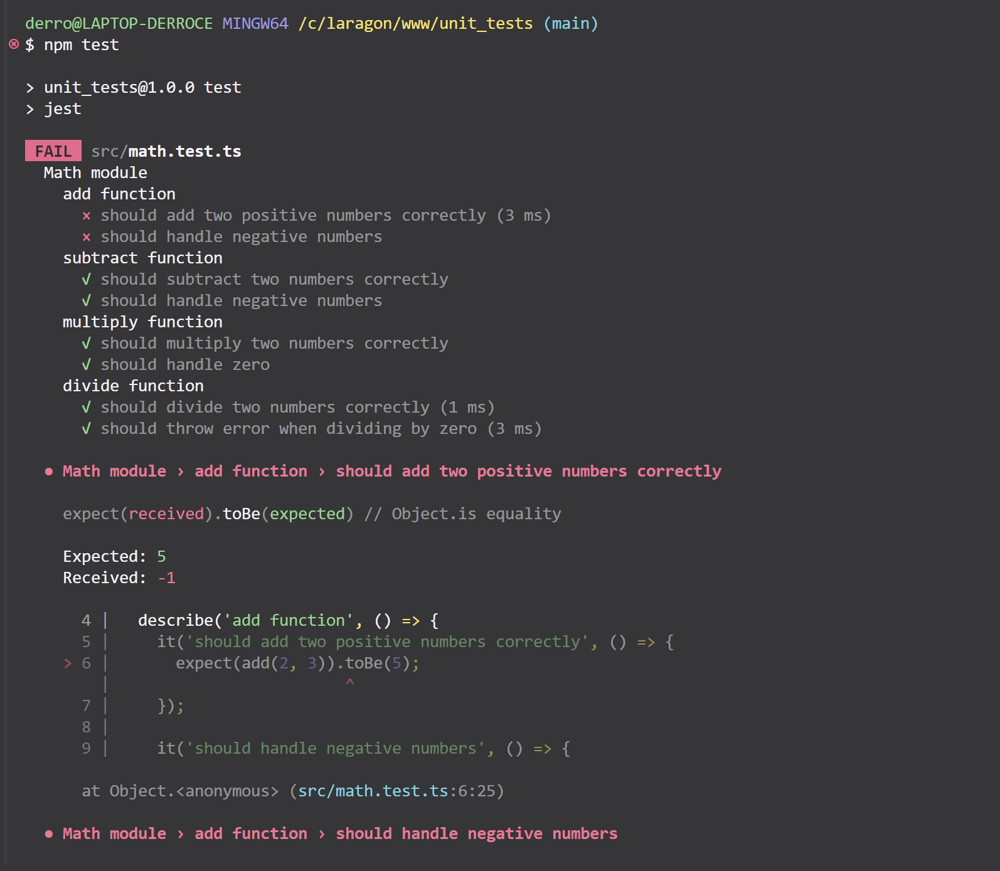
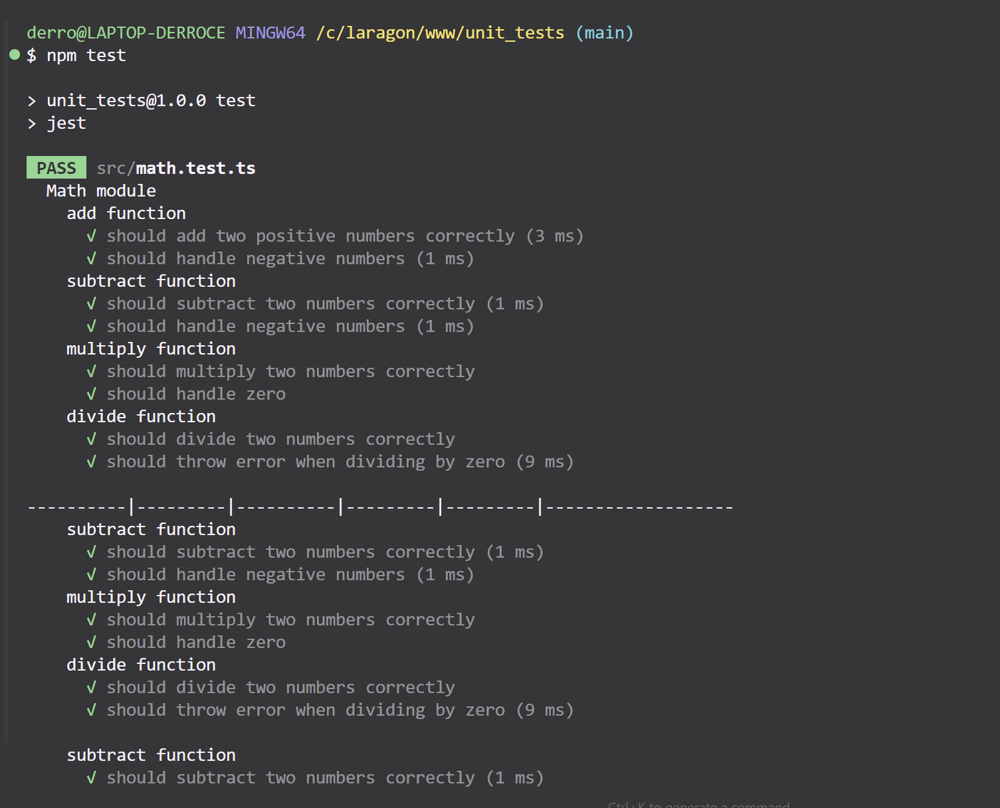

# test-unitaire-debutant

Projet d'initiation aux tests unitaires avec Node.js et Jest.

## Objectif
- Mettre en place un environnement de test avec Jest
- Écrire une fonction simple (`add`)
- Écrire un test unitaire pour cette fonction

## Installation
```bash
npm install
```

## Lancer les tests
```bash
npm test
```

## Résultat attendu

### 1. Exemple de test en échec (fonction volontairement erronée)

*Le test échoue car la fonction `add` ne retourne pas la bonne valeur.*

### 2. Exemple de test réussi (fonction corrigée)

*Après correction de la fonction, tous les tests passent.*

## Structure du projet
- `src/math.ts` : la fonction à tester
- `src/math.test.ts` : le test unitaire
- `images/screen-failed.png` : capture d'écran d'un test en échec
- `images/screen-passed.png` : capture d'écran d'un test réussi

## Commandes utiles
- `npm install` : installe les dépendances
- `npm test` : lance les tests unitaires

## Bonnes pratiques
- Commits réguliers et explicites
- Documentation claire dans le README
- Captures d'écran pour illustrer le process

 
