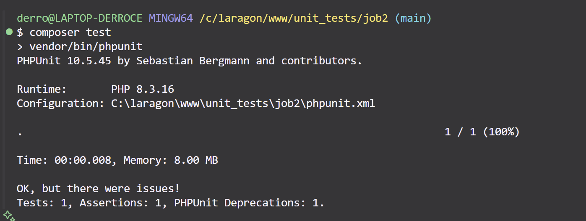
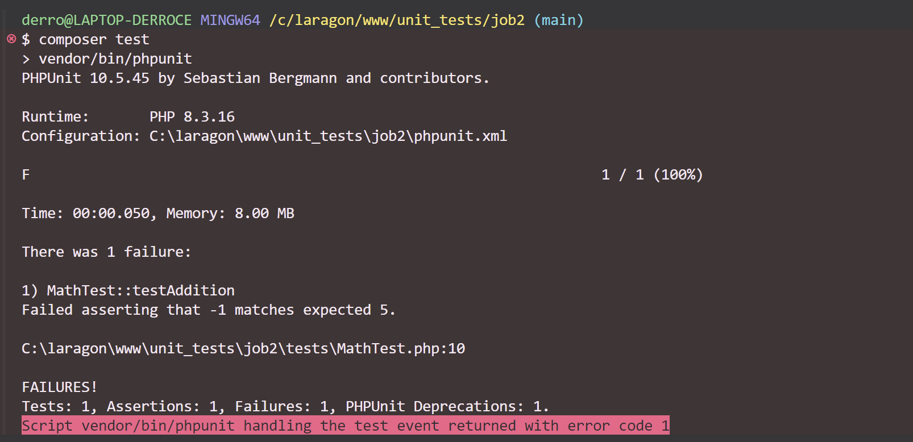

# test-unitaire-php-debutant

Projet d'initiation aux tests unitaires avec PHP et PHPUnit.

## Objectif
- Mettre en place un environnement de test avec PHPUnit
- Écrire une classe PHP simple (`Math`)
- Écrire un test unitaire pour cette classe

## Installation
```bash
composer install
```

## Lancer les tests
```bash
composer test
```

## Résultat attendu

### 1. Exemple de test réussi (fonction correcte)

*Tous les tests passent car la méthode `addition` retourne la bonne valeur.*

### 2. Exemple de test en échec (fonction volontairement erronée)

*Le test échoue car la méthode `addition` retourne -1 au lieu de 5.*

## Structure du projet
- `src/Math.php` : la classe à tester
- `tests/MathTest.php` : le test unitaire
- `phpunit.xml` : configuration de PHPUnit
- `images/job2-screen1.png` : capture d'écran d'un test réussi
- `images/job2-screen2.png` : capture d'écran d'un test en échec

## Commandes utiles
- `composer install` : installe les dépendances
- `composer test` : lance les tests unitaires

## Bonnes pratiques
- Commits réguliers et explicites
- Documentation claire dans le README
- Captures d'écran pour illustrer le process
- Tests unitaires bien documentés
