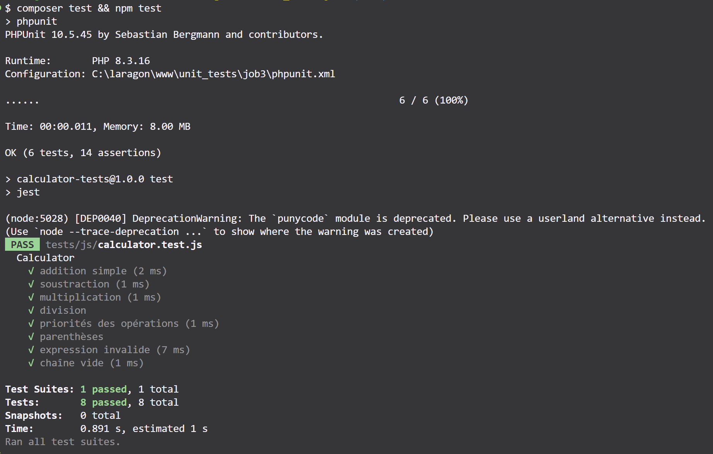

## Installation

1. Installer les dépendances PHP :
   ```bash
   composer install
   ```
2. Installer les dépendances JavaScript :
   ```bash
   npm install
   ```

## Lancer les Tests

### Tests PHP (PHPUnit)
```bash
composer test
```

### Tests JavaScript (Jest)
```bash
npm test
```

---

## **Exécution des tests**

### Résultat des tests (PHP & JS)



*La capture ci-dessus montre que tous les tests unitaires PHP (PHPUnit) et JavaScript (Jest) passent sans erreur.*

---

## Conseils pour compléter le README

- **Ajoute une capture d’écran** pour chaque étape importante :
  - Installation des dépendances (`composer install`, `npm install`)
  - Lancement des tests (comme déjà fait)
  - Structure du projet dans l’explorateur de fichiers ou terminal
  - (Optionnel) Accès à l’interface web (si tu veux montrer que ce n’est pas obligatoire)
  - (Optionnel) Exemple d’erreur et sa correction

- **Pour chaque capture**, ajoute une explication en dessous, comme ci-dessus.

  ```markdown
  
  ```
  [Source : StackOverflow - How to add screenshot to READMEs in github repository?](https://stackoverflow.com/questions/10189356/how-to-add-screenshot-to-readmes-in-github-repository)

